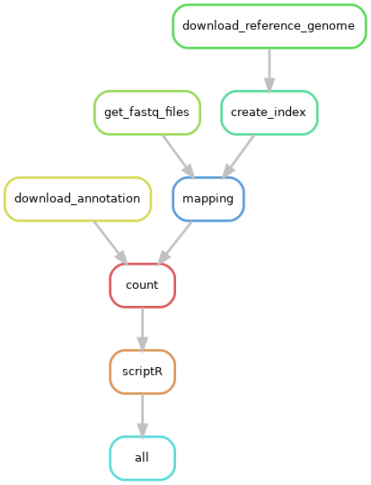
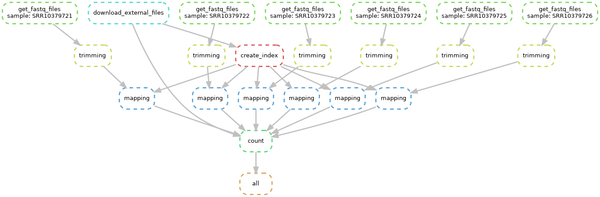

# Projet Reprohackaton (Groupe 8)

## Table des matières

- [Projet Reprohackaton (Groupe 8)](#projet-reprohackaton-groupe-8)
  - [Table des matières](#table-des-matières)
  - [Membres du groupe](#membres-du-groupe)
  - [Outils](#outils)
  - [Architecture du projet](#architecture-du-projet)
  - [Architecture du workflow](#architecture-du-workflow)

## Membres du groupe

- Ambroise BERTIN
- Jules DUPONT
- Julien GIOVANAZZI
- Matthieu VERLYNDE

## Outils

- Docker        (version  )
- Snakemake     (version  )
- Apptainer     (version  )
- SRA Toolkit   (version 3.0.7)
- Bowtie        (latest version 1.2.2 | paper version 0.12.7)
- TrimGalore    (latest version 0.6.10 | paper version unknown)
- Cutadapt      (latest version ..... | paper version .....)
- Subread       (latest version ..... | paper version .....)
- DESeq2        (latest version ..... | paper version .....)
- R             (latest version ..... | paper version .....)

## Architecture du projet

```
Reprohackaton
├── README.md
├── config
├── resources
│   ├── dockerfiles
│   │   ├── readme.md
│   │   ├── bowtie
│   │   ├── deseq2
│   │   ├── subread
│   │   └── trimgalore
├── results
│   └── readme.md
└── workflow
    ├── Snakefile
    └── scripts
```
Note pour plus tard: réalisé avec `tree > fichier.md`
Expliquer la structure sous le format
https://snakemake.readthedocs.io/en/stable/snakefiles/deployment.html 

## Architecture du workflow

Ce workflow est composé de X étapes: <br>


